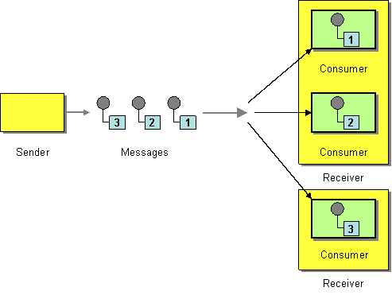
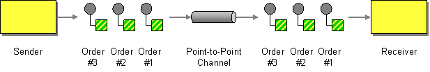
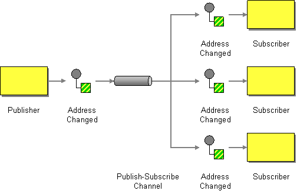
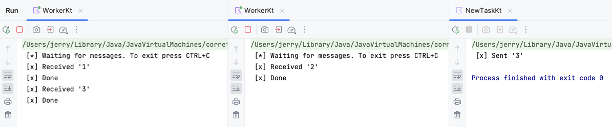

# 튜토리얼2
목표 : competing consumers pattern을 활용한 workers로 분산 작업을 구현한다

참조
- 
- https://www.enterpriseintegrationpatterns.com/patterns/messaging/CompetingConsumers.html
- https://www.enterpriseintegrationpatterns.com/patterns/messaging/PointToPointChannel.html
- https://www.enterpriseintegrationpatterns.com/patterns/messaging/PublishSubscribeChannel.html

# 알아야 하는 개념
- `competing consumers` : 여러 consumer가 하나의 queue를 공유하는 것
  - producer가 queue에 메시지를 쌓는 속도가 consumser가 메시지를 소비하는 속도보다 빠를 때 사용
  - 메시지를 병렬적으로 처리하는 것이지 같은 메시지를 동시에 처리하는 것은 아님
  
  - 단일 채널에 여러 consumer가 연결된 것이라 볼 수 있음. consumers들 끼리는 자기가 메시지를 받기 위해 서로 경쟁하는 셈.
    - point-to-point-channel에서만 동작한다. (pub-sub channel x)
  - apache kafka의 consumer group도 이와 비슷한 개념이다.

- `point-to-point-channel` : 하나의 receiver에게만 메시지를 수신하도록 보장한다.
  - 채널에 여러 receivers가 존재하면 그중 하나만 메시지를 소비할 수 있다.  

  

- `publish-subscribe-channel` : 특정한 메시지를 복사해서 여러 receivers에 이벤트를 전달한다.
  - 입력 채널 하나에 subscribers에 대해 각각의 출력 채널을 할당한다.



- `Work Queue` : `Task Queue` / `작업 대기열`이라고도 부른다. resources가 많이 필요한 작업일 경우 즉시 처리하면서 blocking되는 걸 피하고, 나중에 완료하도록 예약하는 방법이다.
  - 작업을 메시지로 캡슐화해서 대기열(queue)로 보내고, 백그라운드에서 실행 중인 `worker process`가 메시지를 꺼내 작업(job)한다.
  - 짧은 HTTP 요청 처리 기간 안에 복잡한 처리를 해야하는 웹 애플리케이션에서 유용하다.

# 본문

## Competing Consumers
competing consumers pattern을 활용한 workers로 분산 작업을 구현해 보도록 한다.

NewTask.kt
```kotlin
fun main(args: Array<String>) {
    val factory = ConnectionFactory()
    factory.host = "localhost"
    factory.username = "user"
    factory.password = "password"
    factory.newConnection().use { connection ->
        val channel = connection.createChannel()
        channel.queueDeclare(QUEUE_NAME, false, false, false, null)
        val message = args.joinToString(" ")
        channel.basicPublish("", QUEUE_NAME, null, message.toByteArray())
        println(" [x] Sent '$message'")
    }
}
```

Worker.kt
```kotlin
fun main() {
    val factory = ConnectionFactory()
    factory.host = "localhost"
    factory.username = "user"
    factory.password = "password"
    val connection = factory.newConnection()
    val channel = connection.createChannel()

    channel.queueDeclare(QUEUE_NAME, false, false, false, null)
    println(" [*] Waiting for messages. To exit press CTRL+C")

    val deliverCallback = {consumerTag: String, delivery: Delivery ->
        val message = String(delivery.body, charset("UTF-8"))
        println(" [x] Received '$message'")

        try {
            doWork()
        } finally {
            println(" [x] Done")
        }
    }
    channel.basicConsume(QUEUE_NAME, true, deliverCallback) { _ -> }
}

// CPU intensive한 작업을 시뮬레이션하기 위해 fake task를 생성한다.
fun doWork() {
    Thread.sleep(10000)
}
```

Worker를 2개 띄우고 NewTask param에 1, 2, 3을 주어 실행해 보았더니 다음과 같이 round robin된 것을 확인할 수 있었다.
- IntelliJ에서 같은 애플리케이션을 한 번에 여럿 실행시키려면 Configuration - Allow parallel run 체크해서 실행하면 된다.


## Acknowledgement

rabbitMQ는 ack를 지원한다. 따라서 consumer에서 ack를 받지 못하면 queue에서 해당 메시지를 삭제하지 않고 다른 consumer로 전송한다.

이번에는 ack를 조정해서 queue에서 메시지를 어떻게 처리하는지 확인해 보자. 바뀐 점은 다음과 같다.
1. channel.basicQos(1) 옵션을 주어 한 번에 하나의 unack 메시지를 처리할 수 있도록 했다.
2. basicAck를 주었다.
3. autoAck 옵션을 false로 주었다.

autoAck는 consumer에서 메시지를 받으면 바로 ack를 날리도록 하는 옵션이다. 만약 consumer에서 메시지를 처리하지 못하고 죽게 되면(채널이 닫히거나, 연결이 끊어지거나, TCP 연결이 끊어지면) 메시지가 유실된다.

반면에 basicAck는 수동으로 ack를 보내는 방식이다. 따라서 메시지 유실이 걱정된다면 autoAck=false로 두고 basicAck를 추가하는 것이 낫다.

Worker.kt
```kotlin
fun main() {
    val factory = ConnectionFactory()
    factory.host = "localhost"
    factory.username = "user"
    factory.password = "password"
    val connection = factory.newConnection()
    val channel = connection.createChannel()

    channel.queueDeclare(QUEUE_NAME, false, false, false, null)
    println(" [*] Waiting for messages. To exit press CTRL+C")

    // 한 번에 하나의 unack 메시지를 처리할 수 있도록 한다
    channel.basicQos(1)
    val deliverCallback = {consumerTag: String, delivery: Delivery ->
        val message = String(delivery.body, charset("UTF-8"))
        println(" [x] Received '$message'")

        try {
            doWork()
        } finally {
            println(" [x] Done")
            // 메시지 처리 이후 ack를 보내 queue에서 메시지를 삭제할 수 있도록 한다
            channel.basicAck(delivery.envelope.deliveryTag, false)
        }
    }
    val autoAck = false
    // autoAck=true : consumer에 메시지가 전달되기만 하면 바로 ack를 보내, queue에서 삭제한다
    // consumer가 메시지를 처리하지 못하고 죽으면(채널이 닫히거나, 연결이 끊어지거나, TCP 연결이 끊어지면) 메시지가 유실된다
    // 메시지 유실이 걱정된다면 autoAck=false로 두고 basicAck를 추가하는 것이 낫다
    channel.basicConsume(QUEUE_NAME, autoAck, deliverCallback) { _ -> }
}

// CPU intensive한 작업을 시뮬레이션하기 위해 fake task를 생성한다.
fun doWork() {
    Thread.sleep(10000)
}
```

## Message durability

rabbitMQ의 durability, MessageProperties.PERSTSTENT_TEXT_PLAIN 옵션은 rabbitMQ가 죽더라도 되살아났을 때 메시지와 queue를 되살릴 수 있게 된다. 즉, 메시지를 disk에 저장한다고 볼 수 있다.

변경 사항은 다음과 같다.
1. consumer : durable 옵션을 추가한다.
2. publisher : MessageProperties.PERSISTENT_TEXT_PLAIN 옵션을 추가한다.

NewTask(publisher)
```kotlin
fun main(args: Array<String>) {
    val factory = ConnectionFactory()
    factory.host = "localhost"
    factory.username = "user"
    factory.password = "password"
    factory.newConnection().use { connection ->
        val channel = connection.createChannel()
        channel.queueDeclare(QUEUE_NAME, false, false, false, null)
        val message = args.joinToString(" ")
        // publisher에서 메시지를 전송할 때 영구 저장하도록 알린다
        channel.basicPublish("", QUEUE_NAME, MessageProperties.PERSISTENT_TEXT_PLAIN, message.toByteArray())
        println(" [x] Sent '$message'")
    }
}
```

Worker(consumer)
```kotlin
fun main() {
    val factory = ConnectionFactory()
    factory.host = "localhost"
    factory.username = "user"
    factory.password = "password"
    val connection = factory.newConnection()
    val channel = connection.createChannel()

    // 서버가 재시작되면 queue가 되살아나도록 한다
    val durability = true
    channel.queueDeclare(QUEUE_NAME, durability, false, false, null)
    println(" [*] Waiting for messages. To exit press CTRL+C")

    // 한 번에 하나의 unack 메시지를 처리할 수 있도록 한다
    channel.basicQos(1)
    val deliverCallback = {consumerTag: String, delivery: Delivery ->
        val message = String(delivery.body, charset("UTF-8"))
        println(" [x] Received '$message'")

        try {
            doWork()
        } finally {
            println(" [x] Done")
            // 메시지 처리 이후 ack를 보내 queue에서 메시지를 삭제할 수 있도록 한다
            channel.basicAck(delivery.envelope.deliveryTag, false)
        }
    }
    val autoAck = false
    // autoAck=true : consumer에 메시지가 전달되기만 하면 바로 ack를 보내, queue에서 삭제한다
    // consumer가 메시지를 처리하지 못하고 죽으면(채널이 닫히거나, 연결이 끊어지거나, TCP 연결이 끊어지면) 메시지가 유실된다
    // 메시지 유실이 걱정된다면 autoAck=false로 두고 basicAck를 추가하는 것이 낫다
    channel.basicConsume(QUEUE_NAME, autoAck, deliverCallback) { _ -> }
}

// CPU intensive한 작업을 시뮬레이션하기 위해 fake task를 생성한다.
fun doWork() {
    Thread.sleep(10000)
}
```

## Fair dispatch

rabbitMQ는 기본적으로 round-robin 방식으로 메시지를 전달한다. 따라서 worker가 모두 동일한 작업량을 처리한다는 보장이 없다. 이를 해결하기 위해 `prefetchCount`를 사용한다.

prefetchCount는 consumer가 unack 메시지를 받을 수 있는 최대 개수를 의미한다. 따라서 consumer가 unack 메시지를 처리하고 ack를 보내기 전까지는 다른 메시지를 받지 않는다.

만약 모든 consumer가 바쁘다면 worker를 추가하던가 다른 전략을 세울 수 있다.

```kotlin
val prefetchCount = 1
channel.basicQos(prefetchCount)
```